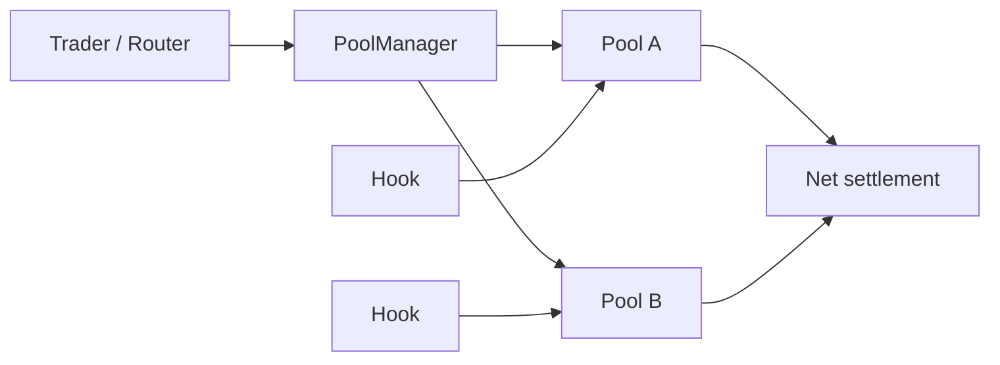
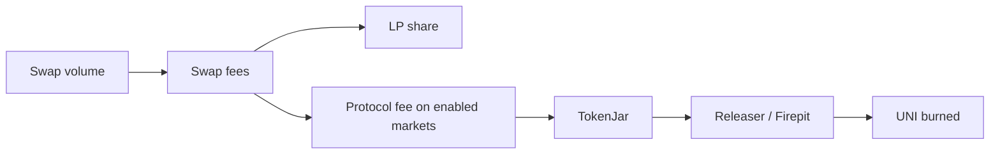

# Uniswap: From AMM to Programmable Liquidity Layer

Independent research project for Crypto Research / On-chain Analyst roles 
Snapshot dates: DefiLlama figures 29 September 2026; on-chain figures 3 October 2026 
Author: @moonlesssssss Dune dashboard: [Live on-chain dashboard](https://dune.com/moonlesssssss/uniswap-market-structure)

The dashboard covers:
- cleaned daily DEX volume;
- 30-day volume by chain;
- protocol-version migration;
- v2 / v3 / v4 share of monthly volume;
- leading markets;
- top-10 transaction-sender concentration.

Raw dex.trades overstates Uniswap volume by up to 68% in some months. Implausible pair-months are removed with documented, rule-based exclusions (section 9.1), and every excluded pair is listed in a public table.

## TL;DR

My research thesis is that Uniswap's strategic value is shifting from a single AMM design toward a **programmable liquidity and execution stack**. The progression is visible in the protocol architecture:

- **v2** established a simple constant-product AMM.
- **v3** made liquidity capital-efficient through concentrated ranges.
- **v4** turns the pool layer into programmable infrastructure through a singleton `PoolManager`, flash accounting, flexible fees and hooks.
- **Unichain** adds a DeFi-focused execution environment around the broader Uniswap ecosystem.
- Since **December 2025**, protocol fees can feed a mechanism that ultimately burns UNI, creating a clearer link between some protocol activity and token supply.

The key research question is not just whether Uniswap processes more volume. It is whether this modular stack can keep attracting developers, liquidity and order flow **without fragmenting liquidity or materially weakening LP economics**.

---

## 1. Why Uniswap?

Uniswap is useful as a research subject because it shows how DEX design has evolved from a relatively simple AMM into a broader liquidity infrastructure layer.

At the 29 September 2026 snapshot, DefiLlama reports approximately:

| Metric | Snapshot |
|---|---:|
| TVL | **$3.917B** |
| 30d DEX volume | **$91.892B** |
| 30d fees | **$208.26M** |
| Chains in DefiLlama DEX dataset | **49** |
| Total tracked DEX 30d volume | **$274.543B** |
| Implied Uniswap share of tracked DEX spot volume | **~33.5%** |

The share figure is a simple `91.892 / 274.543` calculation and should be treated as a point-in-time indicator, not a permanent market-share estimate.


---

## 2. How the protocol evolved

### v2 - constant product

The classic v2 pool follows:

```text
x * y = k
```

Liquidity is spread across the full price curve. The design is simple and robust, but much of an LP's capital can sit far away from the market price and remain underutilized.

The standard v2 swap fee is **0.30%**. Under the current protocol-fee configuration, when enabled, **0.25%** goes to LPs and **0.05%** is the protocol fee.

### v3 - concentrated liquidity

v3 lets LPs choose price ranges. Capital can be concentrated near the active price instead of being deployed across the entire curve.

This improves capital efficiency but makes LPing more active:

- out-of-range positions stop earning fees;
- inventory risk and adverse selection matter more;
- liquidity depth around the current price matters more than headline TVL alone.

### v4 - programmable pools

v4 launched in January 2025. Its most important architectural changes are:

**Singleton / PoolManager**  
Pools are managed through a central `PoolManager` rather than deploying a separate pool contract for each market.

**Flash accounting**  
The protocol can track net balance changes during a transaction and settle at the end, reducing unnecessary intermediate token transfers.

**Hooks**  
A pool can attach an external smart contract that runs custom logic around lifecycle actions such as swaps or liquidity modifications.

Possible hook use cases include:

- dynamic fees;
- custom oracles;
- automated liquidity management;
- limit-order-like behavior;
- permissioned pools;
- custom accounting and pricing logic.

This is why I think the most interesting way to view v4 is **not just as v3 with cheaper gas**, but as a framework for building specialized markets on top of shared settlement and liquidity primitives.

---

## 3. The v4 design thesis

A simplified model:



The key design trade-off is **standardization versus programmability**.

Earlier AMMs made relatively strong assumptions about what a pool should do. v4 moves more behavior into optional hooks. That expands the design space, but it also creates a new risk surface: two pools that both say "Uniswap v4" may have materially different behavior because their hooks differ.

For analysts, this means future v4 research should separate:

1. core PoolManager activity;
2. pool-level liquidity and volume;
3. hook-specific behavior;
4. router / aggregator sourced order flow.

---

## 4. Unichain

Unichain mainnet launched on **11 February 2025** as a DeFi-focused Ethereum L2.

From a research perspective, the important question is whether Unichain creates **incremental** activity for the Uniswap ecosystem or mostly relocates activity that would otherwise have happened on Ethereum, Base, Arbitrum or another chain.

Current TVL is still highly concentrated on Ethereum, while Uniswap is broadly deployed across many networks:


A useful future dashboard should therefore track both absolute growth and chain-mix migration.

---

## 5. UNI economics after protocol-fee activation

UNI launched with an initial supply of **1 billion tokens**. Current Uniswap documentation states that there is **no active inflation**, although governance retains authority to mint up to 2% of total supply annually.

The more important recent change is the protocol-fee / burn architecture introduced after the December 2025 governance process.

At a high level:



Current official documentation says protocol fees are active on all v2 pools and selected v3 pools, while v4 adapter flows are part of the broader fee architecture and can be enabled through governance.

This matters because UNI holders still have **no direct pro-rata claim on protocol revenue**. The current value-accrual mechanism works through token burn rather than a cash distribution.

### The economic tension

Protocol fee capture creates a trade-off:

```text
Higher protocol capture
        vs.
Competitive LP returns and liquidity depth
```

If protocol fees become too aggressive, LPs can move capital. If they are too low, protocol activity translates into less UNI burn.

I would treat this balance as one of the highest-value post-2025 metrics to monitor.

---

## 6. Competitive landscape

Uniswap competes with different models, not a single homogeneous DEX category.

| Protocol | Core differentiation | Strategic pressure on Uniswap |
|---|---|---|
| **PancakeSwap** | Multichain AMM; Infinity adds singleton, flash accounting, hooks and multiple pool types | Competes directly on programmable AMM infrastructure and distribution |
| **Aerodrome** | Base-centric liquidity hub with vote-directed AERO emissions and veAERO economics | Competes on liquidity bootstrapping and ecosystem-native incentives |
| **Curve** | StableSwap / specialized curves for correlated assets | Competes where specialized invariants can deliver superior execution |
| **Hyperliquid spot** | Fully on-chain central limit order book | Competes via order-book market structure rather than AMM liquidity |
| **Aggregators / solvers** | Own routing and user order flow while sourcing external liquidity | Can commoditize the underlying venue if execution is routed purely by price |

Current DefiLlama 30-day spot volume snapshot:

| Protocol | 30d volume |
|---|---:|
| Uniswap | $91.892B |
| PancakeSwap | $28.682B |
| Aerodrome | $13.240B |
| Hyperliquid spot | $4.848B |
| Curve | $3.171B |

The important caveat: raw volume does **not** equal product quality or durable market power. It can be influenced by routing, incentives, chain-specific activity, bots and measurement methodology.

---

## 7. What I think is underappreciated

### Hypothesis 1 - Uniswap's competition is moving up the stack

If wallets, aggregators and solver networks increasingly control order routing, the battle is not only "which AMM has the deepest pool?" It is also "which venue remains the preferred execution layer when another product owns the user interface?"

**How I would test it:** estimate direct versus aggregator-routed flow and compare execution quality by venue.

### Hypothesis 2 - v4 success should be measured by differentiated hook adoption

High v4 volume alone would show migration, not necessarily innovation. The stronger evidence would be meaningful activity in hook-enabled pools that create behavior unavailable in standard v3 pools.

**How I would test it:** classify active hooks, then track pool count, liquidity, volume, fees and retention by hook category.

### Hypothesis 3 - protocol fees create a measurable experiment in value capture

The new fee architecture makes it possible to test whether increased protocol capture can coexist with competitive LP economics.

**How I would test it:** run pre/post fee-activation analysis on volume, liquidity, LP migration, spread / execution proxies and UNI burned.

---

## 8. Main risks to the thesis

**Liquidity fragmentation**  
More chains, pool versions, fee configurations and hooks can split liquidity into smaller venues.

**LP economics**  
Protocol fees or adverse selection may make certain pools less attractive to LPs.

**Hook complexity / security**  
Programmability adds flexibility but also expands the set of behaviors and smart-contract risks users must understand.

**Order-flow commoditization**  
If aggregators route flow based purely on best execution, underlying AMMs may have weaker direct user relationships.

**Specialized competitors**  
A general liquidity layer can lose particular markets to protocols optimized for stablecoins, chain-native incentives or professional order-book trading.

**Data quality**  
Volume, active-address and TVL metrics can be distorted by bots, smart-wallet architecture, routing and temporary incentives.

---

## 9. On-chain findings

## 9. On-chain findings

I built a [live Dune dashboard](https://dune.com/moonlesssssss/uniswap-market-structure) to test the thesis against on-chain data instead of relying only on documentation or market-level snapshots. All figures in this section come from queries run on **3 October 2026** (data to 2 Oct). Rolling windows move daily, so re-running them later gives slightly different numbers.

### Key findings

1. **Raw `dex.trades` overstates Uniswap volume: by 40% in Oct 2025 and by 68% in Sep 2026.** The excess comes from mispriced or implausible pair-months, for example memecoin-WETH pairs with a median trade above $9M, or obscure v4 pairs with a single ~$500M trade.
2. **v4 gained share, but v4 volume barely moved.** Its share of monthly volume rose from 27.3% (Oct 2025) to 46.4% (Sep 2026), yet v4 volume stayed in a $22-44B/month range ($36.9B in Oct 2025, $44.0B in Sep 2026). The share gain came mostly from v2 ($12.4B to $2.9B) and v3 ($85.9B to $47.9B) shrinking. v4 had more volume than v3 in only 3 of 12 months (Jan, Jun, Jul 2026).
3. **Robinhood Chain is the largest chain, and its biggest market is dominated by a few automated senders.** It holds 45.0% of 30-day volume ($42.7B of $94.7B) against 27.2% for Ethereum. In USDG-WETH ($15.5B, 16.4% of all Uniswap volume), the 3,907 senders (0.8%) with more than 1,000 swaps in 30 days produce 72.6% of the volume.
4. **The top 10 transaction senders are 6.9%-22.9% of daily volume.** Their own volume is steady (typically $0.35-0.55B per day), so the share moves mostly with total daily volume.

### 9.1 Data-quality investigation: raw vs cleaned volume

Query: [`07_raw_vs_cleaned_monthly.sql`](sql/07_raw_vs_cleaned_monthly.sql) ([Dune](https://dune.com/queries/8890199))

| Month | Raw (USD bn) | Excluded (USD bn) | Cleaned (USD bn) | Excluded share |
|---|---:|---:|---:|---:|
| Oct 2025 | 224.79 | 89.52 | 135.27 | 39.8% |
| Nov 2025 | 129.90 | 46.32 | 83.59 | 35.7% |
| Dec 2025 | 89.59 | 24.32 | 65.26 | 27.2% |
| Jan 2026 | 96.56 | 8.44 | 88.12 | 8.7% |
| Feb 2026 | 82.55 | 0.86 | 81.69 | 1.0% |
| Mar 2026 | 69.22 | 1.74 | 67.47 | 2.5% |
| Apr 2026 | 64.78 | 0.38 | 64.40 | 0.6% |
| May 2026 | 61.12 | 0.72 | 60.40 | 1.2% |
| Jun 2026 | 66.69 | 0.22 | 66.47 | 0.3% |
| Jul 2026 | 71.33 | 0.50 | 70.82 | 0.7% |
| Aug 2026 | 175.89 | 117.78 | 58.12 | 67.0% |
| Sep 2026 | 293.58 | 198.83 | 94.75 | 67.7% |

The workflow:

```
raw aggregation -> outlier screen (06) -> exclusion rules (00) -> cleaned dataset (01-05)
```

The first version of this project excluded three pairs and eight transaction hashes by hand. A systematic 12-month screen ([`06_data_quality_audit.sql`](sql/06_data_quality_audit.sql)) showed that this caught only part of the problem, so the exclusions are now rule-based and live in one table, `dune.moonlesssssss.result_uniswap_excluded_pair_months` (53 rows), built by [`00_excluded_pair_months.sql`](sql/00_excluded_pair_months.sql). Every other query anti-joins that table. A pair-month is one (chain, token pair, version, month) combination, and only those with at least $100M of volume are tested:

- **R1:** median trade size of at least $1M.
- **R2:** at most 1,000 transactions, median trade below $1K, and a largest trade of at least $5M.
- **R3:** a pair flagged by R1 or R2 in at least 3 months is excluded in all months.
- **M1:** `robinhood AI-WETH`, `robinhood COBIE-ETH` and `ethereum MAHC-WETH`, excluded manually in the first version.
- Eight individually audited transaction hashes (listed inside each query).

The largest repeat offenders are all Ethereum v2 token-WETH pairs: BURNETH-WETH, GOLDEN-WETH, 7AΩ∞-WETH, The Glitch-WETH and BULL-WETH. In Aug 2026 the main source was single transactions of about $500M in obscure v4 pairs on Base, Robinhood Chain and Arbitrum.

I still chose rules over a blanket maximum-trade-size filter: large stablecoin trades are legitimate, so each pair is judged against its own trade-size distribution and transaction count.

After cleaning, the daily volume series stays between roughly $0.7B and $4.9B with no residual spikes.

### 9.2 Protocol-version migration

Query: [`03_version_mix_cleaned.sql`](sql/03_version_mix_cleaned.sql). Cleaned volume in USD bn:

| Month | v2 | v3 | v4 | v4 share |
|---|---:|---:|---:|---:|
| Oct 2025 | 12.41 | 85.94 | 36.87 | 27.3% |
| Nov 2025 | 6.10 | 55.39 | 22.10 | 26.4% |
| Dec 2025 | 3.98 | 37.44 | 23.84 | 36.5% |
| Jan 2026 | 4.21 | 40.62 | 43.28 | 49.1% |
| Feb 2026 | 3.30 | 48.43 | 29.95 | 36.7% |
| Mar 2026 | 2.07 | 42.82 | 22.58 | 33.5% |
| Apr 2026 | 2.29 | 36.87 | 25.23 | 39.2% |
| May 2026 | 1.57 | 32.66 | 26.18 | 43.3% |
| Jun 2026 | 1.19 | 25.31 | 39.97 | 60.1% |
| Jul 2026 | 4.92 | 27.27 | 38.64 | 54.6% |
| Aug 2026 | 1.76 | 28.43 | 27.93 | 48.1% |
| Sep 2026 | 2.86 | 47.91 | 43.98 | 46.4% |

This is not a clean migration from v3 to v4. v4 volume is range-bound, v3 is volatile, and v2 has shrunk. Part of v4's share gain is a denominator effect. An earlier version of this README, written before the exclusions above, said that v4 "grows into a major share" and that v2 was a large share in late 2025; both statements were affected by uncleaned data.

### 9.3 Multichain market structure

Query: [`02_chain_mix_cleaned.sql`](sql/02_chain_mix_cleaned.sql). Last 30 full days to 2 Oct 2026:

| Chain | Volume (USD bn) | Share |
|---|---:|---:|
| Robinhood Chain | 42.66 | 45.0% |
| Ethereum | 25.76 | 27.2% |
| Base | 8.96 | 9.5% |
| BNB Chain | 5.98 | 6.3% |
| Arbitrum | 4.60 | 4.9% |

Unichain, the chain discussed in section 4, holds only 0.4% ($0.34B) of the 30-day volume.

**Who generates the volume in Robinhood Chain USDG-WETH?** Query: [`08_robinhood_usdg_weth_senders.sql`](sql/08_robinhood_usdg_weth_senders.sql) ([Dune](https://dune.com/queries/8890201)). The median trade is only $86, which looks like retail, but the volume tells a different story:

| Swaps per sender (30 days) | Senders | % of senders | % of transactions | % of volume |
|---|---:|---:|---:|---:|
| 1 | 118,257 | 25.6% | 0.4% | 0.3% |
| 2-10 | 202,369 | 43.8% | 3.1% | 2.0% |
| 11-100 | 104,398 | 22.6% | 13.2% | 7.6% |
| 101-1,000 | 32,585 | 7.1% | 35.4% | 17.6% |
| more than 1,000 | 3,907 | 0.8% | 47.9% | 72.6% |

A long tail of small accounts coexists with a small group of very active senders that produce most of the volume. This is consistent with automated trading (arbitrage, market making or bots), but this data cannot tell which. The first version of this README retained Robinhood Chain because its median trade size was small; that was necessary but not sufficient evidence of organic activity.

### 9.4 Market concentration

Query: [`04_top_markets_cleaned.sql`](sql/04_top_markets_cleaned.sql). Markets are analyzed as **blockchain + token pair**, so identical symbols on different chains are not mixed. The top 10 markets account for 43.4% of 30-day volume:

| Market | Volume (USD bn) | Share | Median trade (USD) |
|---|---:|---:|---:|
| robinhood USDG-WETH | 15.48 | 16.4% | 86 |
| ethereum USDC-USDT | 5.81 | 6.1% | 654 |
| ethereum USDC-WETH | 4.07 | 4.3% | 381 |
| base USDC-WETH | 3.22 | 3.4% | 25 |
| robinhood ETH-USDG | 3.12 | 3.3% | 72 |
| ethereum USDS-USDT | 2.81 | 3.0% | 6,156 |
| ethereum USDT-WETH | 2.33 | 2.5% | 530 |
| arbitrum USDC-WETH | 1.71 | 1.8% | 374 |
| bnb QQQB-USDC | 1.38 | 1.5% | 67 |
| ethereum PYUSD-USDS | 1.17 | 1.2% | 4,774 |

### 9.5 Sender concentration

Query: [`05_sender_concentration_cleaned.sql`](sql/05_sender_concentration_cleaned.sql). Over the 30 full days to 2 Oct 2026, the 10 largest transaction senders accounted for 6.9%-22.9% of cleaned daily volume, with roughly 395K-507K active senders per day. Their own daily volume was steady at typically $0.35-0.55B, so the share moves mostly with total volume rather than showing a trend.

I intentionally describe these entities as **transaction senders**, not users or whales, because `tx_from` can represent bots, routers, smart accounts, contracts or other automated actors.

### 9.6 Limitations of the on-chain work

- R1-R3 are heuristics, not proof. A legitimate large trade in a thin pair can be flagged; one possible example is `optimism ETH-S*ETH` in Oct 2026 (3 trades of about $27M each). The full list is in the exclusion table.
- The screen only tests pair-months of at least $100M, so smaller residual distortions may remain.
- `amount_usd` depends on Dune's price feeds, and multi-hop swaps are counted per segment.
- The exclusion table is a materialized view refreshed manually; the other queries use rolling windows.
- Not done yet: identifying the top USDG-WETH senders (contracts versus wallets, time-of-day patterns) to confirm automation, and running the fee-switch hypothesis (Hypothesis 3) as a pre/post test.

## 10. Methodology caveats

### `dex.trades` is segment-level data

Dune's curated `dex.trades` dataset records each segment of multi-hop trades. `COUNT(*)` therefore should not automatically be interpreted as the number of end-user swaps.

### Address != human

An address may be a person, smart account, router, bot, market maker or contract. I describe `COUNT(DISTINCT tx_from)` as **active transaction senders**, not unique users.

### Point-in-time market data

All DefiLlama metrics in this report are a 29 September 2026 snapshot and should be refreshed before reuse.

---

## Repository structure

```text
uniswap-research/
├── README.md
├── SOURCES.md
└── sql/
    ├── 01_daily_volume_cleaned.sql
    ├── 02_chain_mix_cleaned.sql
    ├── 03_version_mix_cleaned.sql
    ├── 04_top_markets_cleaned.sql
    ├── 05_sender_concentration_cleaned.sql
    └── 06_data_quality_audit.sql
```

The SQL files mirror the methodology used in the live Dune dashboard.

---

## Sources

See [`SOURCES.md`](SOURCES.md) for primary documentation, Dune methodology and market-data references.

## Disclaimer

Independent research for educational and portfolio purposes. Not affiliated with Uniswap Labs and the Uniswap Foundation. Nothing here is financial advice.
