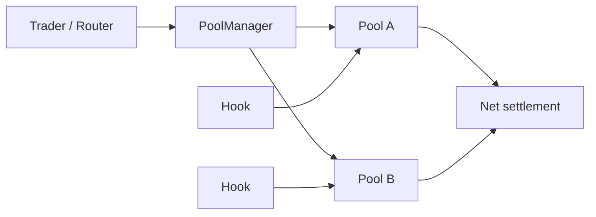
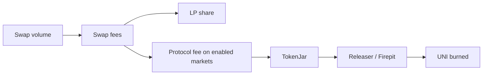

# Uniswap: From AMM to Programmable Liquidity Layer

Independent research project for Crypto Research / On-chain Analyst roles 
Snapshot dates: DefiLlama figures 29 September 2026; on-chain figures 3 October 2026 
Author: @moonlesssssss Dune dashboard: [Live on-chain dashboard](https://dune.com/moonlesssssss/uniswap-market-structure)

The dashboard covers:
- cleaned daily DEX volume;
- 30-day volume by chain;
- protocol-version migration;
- v2 / v3 / v4 share of monthly volume;
- leading markets;
- top-10 transaction-sender concentration.

Raw dex.trades overstates Uniswap volume by up to 68% in some months. Implausible pair-months are removed with documented, rule-based exclusions (section 9.1), and every excluded pair is listed in a public table.

## TL;DR

My research thesis is that Uniswap's strategic value is shifting from a single AMM design toward a **programmable liquidity and execution stack**. The progression is visible in the protocol architecture:

- **v2** established a simple constant-product AMM.
- **v3** made liquidity capital-efficient through concentrated ranges.
- **v4** turns the pool layer into programmable infrastructure through a singleton `PoolManager`, flash accounting, flexible fees and hooks.
- **Unichain** adds a DeFi-focused execution environment around the broader Uniswap ecosystem.
- Since **December 2025**, protocol fees can feed a mechanism that ultimately burns UNI, creating a clearer link between some protocol activity and token supply.

The key research question is not just whether Uniswap processes more volume. It is whether this modular stack can keep attracting developers, liquidity and order flow **without fragmenting liquidity or materially weakening LP economics**.

---

## 1. Why Uniswap?

Uniswap is useful as a research subject because it shows how DEX design has evolved from a relatively simple AMM into a broader liquidity infrastructure layer.

At the 29 September 2026 snapshot, DefiLlama reports approximately:

| Metric | Snapshot |
|---|---:|
| TVL | **$3.917B** |
| 30d DEX volume | **$91.892B** |
| 30d fees | **$208.26M** |
| Chains in DefiLlama DEX dataset | **49** |
| Total tracked DEX 30d volume | **$274.543B** |
| Implied Uniswap share of tracked DEX spot volume | **~33.5%** |

The share figure is a simple `91.892 / 274.543` calculation and should be treated as a point-in-time indicator, not a permanent market-share estimate.


---

## 2. How the protocol evolved

### v2 - constant product

The classic v2 pool follows:

```text
x * y = k
```

Liquidity is spread across the full price curve. The design is simple and robust, but much of an LP's capital can sit far away from the market price and remain underutilized.

The standard v2 swap fee is **0.30%**. Under the current protocol-fee configuration, when enabled, **0.25%** goes to LPs and **0.05%** is the protocol fee.

### v3 - concentrated liquidity

v3 lets LPs choose price ranges. Capital can be concentrated near the active price instead of being deployed across the entire curve.

This improves capital efficiency but makes LPing more active:

- out-of-range positions stop earning fees;
- inventory risk and adverse selection matter more;
- liquidity depth around the current price matters more than headline TVL alone.

### v4 - programmable pools

v4 launched in January 2025. Its most important architectural changes are:

**Singleton / PoolManager**  
Pools are managed through a central `PoolManager` rather than deploying a separate pool contract for each market.

**Flash accounting**  
The protocol can track net balance changes during a transaction and settle at the end, reducing unnecessary intermediate token transfers.

**Hooks**  
A pool can attach an external smart contract that runs custom logic around lifecycle actions such as swaps or liquidity modifications.

Possible hook use cases include:

- dynamic fees;
- custom oracles;
- automated liquidity management;
- limit-order-like behavior;
- permissioned pools;
- custom accounting and pricing logic.

This is why I think the most interesting way to view v4 is **not just as v3 with cheaper gas**, but as a framework for building specialized markets on top of shared settlement and liquidity primitives.

---

## 3. The v4 design thesis

A simplified model:



The key design trade-off is **standardization versus programmability**.

Earlier AMMs made relatively strong assumptions about what a pool should do. v4 moves more behavior into optional hooks. That expands the design space, but it also creates a new risk surface: two pools that both say "Uniswap v4" may have materially different behavior because their hooks differ.

For analysts, this means future v4 research should separate:

1. core PoolManager activity;
2. pool-level liquidity and volume;
3. hook-specific behavior;
4. router / aggregator sourced order flow.

---

## 4. Unichain

Unichain mainnet launched on **11 February 2025** as a DeFi-focused Ethereum L2.

From a research perspective, the important question is whether Unichain creates **incremental** activity for the Uniswap ecosystem or mostly relocates activity that would otherwise have happened on Ethereum, Base, Arbitrum or another chain.

Current TVL is still highly concentrated on Ethereum, while Uniswap is broadly deployed across many networks:


A useful future dashboard should therefore track both absolute growth and chain-mix migration.

---

## 5. UNI economics after protocol-fee activation

UNI launched with an initial supply of **1 billion tokens**. Current Uniswap documentation states that there is **no active inflation**, although governance retains authority to mint up to 2% of total supply annually.

The more important recent change is the protocol-fee / burn architecture introduced after the December 2025 governance process.

At a high level:



Current official documentation says protocol fees are active on all v2 pools and selected v3 pools, while v4 adapter flows are part of the broader fee architecture and can be enabled through governance.

This matters because UNI holders still have **no direct pro-rata claim on protocol revenue**. The current value-accrual mechanism works through token burn rather than a cash distribution.

### The economic tension

Protocol fee capture creates a trade-off:

```text
Higher protocol capture
        vs.
Competitive LP returns and liquidity depth
```

If protocol fees become too aggressive, LPs can move capital. If they are too low, protocol activity translates into less UNI burn.

I would treat this balance as one of the highest-value post-2025 metrics to monitor.

---

## 6. Competitive landscape

Uniswap competes with different models, not a single homogeneous DEX category.

| Protocol | Core differentiation | Strategic pressure on Uniswap |
|---|---|---|
| **PancakeSwap** | Multichain AMM; Infinity adds singleton, flash accounting, hooks and multiple pool types | Competes directly on programmable AMM infrastructure and distribution |
| **Aerodrome** | Base-centric liquidity hub with vote-directed AERO emissions and veAERO economics | Competes on liquidity bootstrapping and ecosystem-native incentives |
| **Curve** | StableSwap / specialized curves for correlated assets | Competes where specialized invariants can deliver superior execution |
| **Hyperliquid spot** | Fully on-chain central limit order book | Competes via order-book market structure rather than AMM liquidity |
| **Aggregators / solvers** | Own routing and user order flow while sourcing external liquidity | Can commoditize the underlying venue if execution is routed purely by price |

Current DefiLlama 30-day spot volume snapshot:

| Protocol | 30d volume |
|---|---:|
| Uniswap | $91.892B |
| PancakeSwap | $28.682B |
| Aerodrome | $13.240B |
| Hyperliquid spot | $4.848B |
| Curve | $3.171B |

The important caveat: raw volume does **not** equal product quality or durable market power. It can be influenced by routing, incentives, chain-specific activity, bots and measurement methodology.

---

## 7. What I think is underappreciated

### Hypothesis 1 - Uniswap's competition is moving up the stack

If wallets, aggregators and solver networks increasingly control order routing, the battle is not only "which AMM has the deepest pool?" It is also "which venue remains the preferred execution layer when another product owns the user interface?"

**How I would test it:** estimate direct versus aggregator-routed flow and compare execution quality by venue.

### Hypothesis 2 - v4 success should be measured by differentiated hook adoption

High v4 volume alone would show migration, not necessarily innovation. The stronger evidence would be meaningful activity in hook-enabled pools that create behavior unavailable in standard v3 pools.

**How I would test it:** classify active hooks, then track pool count, liquidity, volume, fees and retention by hook category.

### Hypothesis 3 - protocol fees create a measurable experiment in value capture

The new fee architecture makes it possible to test whether increased protocol capture can coexist with competitive LP economics.

**How I would test it:** run pre/post fee-activation analysis on volume, liquidity, LP migration, spread / execution proxies and UNI burned.

---

## 8. Main risks to the thesis

**Liquidity fragmentation**  
More chains, pool versions, fee configurations and hooks can split liquidity into smaller venues.

**LP economics**  
Protocol fees or adverse selection may make certain pools less attractive to LPs.

**Hook complexity / security**  
Programmability adds flexibility but also expands the set of behaviors and smart-contract risks users must understand.

**Order-flow commoditization**  
If aggregators route flow based purely on best execution, underlying AMMs may have weaker direct user relationships.

**Specialized competitors**  
A general liquidity layer can lose particular markets to protocols optimized for stablecoins, chain-native incentives or professional order-book trading.

**Data quality**  
Volume, active-address and TVL metrics can be distorted by bots, smart-wallet architecture, routing and temporary incentives.

---

## 9. On-chain findings

I built a [live Dune dashboard](https://dune.com/moonlesssssss/uniswap-market-structure) to test the thesis against on-chain data rather than relying only on protocol documentation or market-level snapshots.

### 9.1 Protocol-version migration

After removing identified data-quality outliers, the migration toward **Uniswap v4 remains visible** in the data.

- v2 declines to a relatively small share of monthly volume.
- v3 remains a major source of trading activity.
- v4 grows into a major share of monthly volume alongside v3.

The important point is that the v4 trend survives the cleaning process. It is therefore not explained solely by a small number of extreme transactions.

### 9.2 Multichain market structure

Uniswap activity is distributed across multiple chains rather than being exclusively dependent on Ethereum mainnet.

During validation, Robinhood Chain initially appeared anomalously dominant in raw volume. Instead of excluding the chain outright, I audited its leading pairs using transaction count, active senders, average trade size, median trade size, p99 trade size and maximum trade size.

After removing confirmed outliers, the remaining Robinhood activity was spread across high-transaction-count markets with substantially smaller median trade sizes, so the chain was retained in the cleaned dataset.

### 9.3 Market concentration

The largest markets account for a meaningful share of Uniswap volume, but activity extends across a broader set of pairs and chains.

Markets are analyzed as **blockchain + token pair** rather than aggregating identical symbols across networks. This avoids mixing economically different markets into a single label.

### 9.4 Sender concentration

Across the observed 30-day period, the 10 largest transaction senders generally account for a **minority** of cleaned daily DEX volume.

I intentionally describe these entities as **transaction senders**, not users or whales, because `tx_from` can represent bots, routers, smart accounts, contracts or other automated actors.

### 9.5 Data-quality investigation

Raw aggregation of Dune's `dex.trades` dataset produced several extreme USD-volume outliers.

The workflow used in this project was:

```text
raw aggregation
      |
      v
sanity check
      |
      v
pair / transaction investigation
      |
      v
targeted exclusions
      |
      v
cleaned analytical dataset
```

The largest anomalies were traced to specific token pairs and transaction hashes. I used targeted exclusions instead of:

- deleting entire chains;
- applying a blanket maximum-trade-size filter;
- assuming raw `amount_usd` was ground truth.

This preserves legitimate large trades while making the cleaning methodology explicit and reproducible.

The cleaned dataset powers the dashboard views for daily volume, chain mix, version migration, top markets and sender concentration.

---

## 10. Methodology caveats

### `dex.trades` is segment-level data

Dune's curated `dex.trades` dataset records each segment of multi-hop trades. `COUNT(*)` therefore should not automatically be interpreted as the number of end-user swaps.

### Address != human

An address may be a person, smart account, router, bot, market maker or contract. I describe `COUNT(DISTINCT tx_from)` as **active transaction senders**, not unique users.

### Point-in-time market data

All DefiLlama metrics in this report are a 29 September 2026 snapshot and should be refreshed before reuse.

---

## Repository structure

```text
uniswap-research/
├── README.md
├── SOURCES.md
└── sql/
    ├── 01_daily_volume_cleaned.sql
    ├── 02_chain_mix_cleaned.sql
    ├── 03_version_mix_cleaned.sql
    ├── 04_top_markets_cleaned.sql
    ├── 05_sender_concentration_cleaned.sql
    └── 06_data_quality_audit.sql
```

The SQL files mirror the methodology used in the live Dune dashboard.

---

## Sources

See [`SOURCES.md`](SOURCES.md) for primary documentation, Dune methodology and market-data references.

## Disclaimer

Independent research for educational and portfolio purposes. Not affiliated with Uniswap Labs and the Uniswap Foundation. Nothing here is financial advice.
